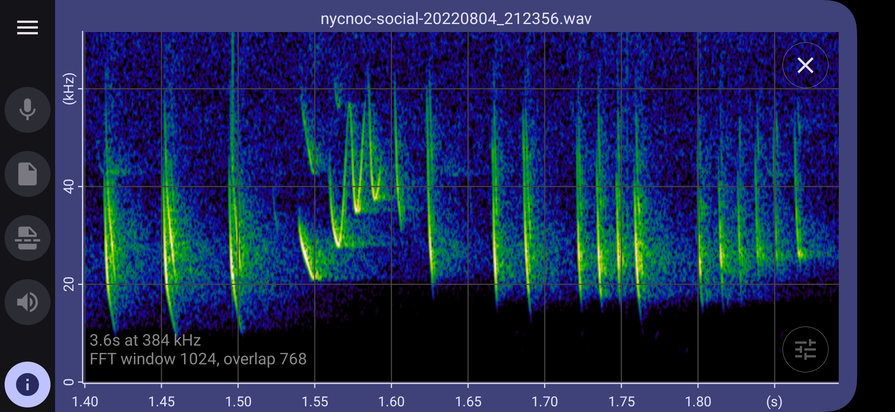

# batgizmo-app
An open source Android App for viewing live and stored bat spectrograms.

User instructions are here: https://twilighttravels.org/batgizmo-app/

## Acknowledgments

Experimental **Auto Id** uses bat species classifiers from
[BattyBirdNET](https://github.com/rdz-oss/BattyBirdNET-Analyzer) by R.D. Zinck,
built on embeddings from [BirdNET](https://birdnet.cornell.edu/) /
[BirdNET-Analyzer](https://github.com/birdnet-team/BirdNET-Analyzer)
(Cornell Lab of Ornithology / Chemnitz University of Technology).

Those model assets are licensed under
[CC BY-NC-SA 4.0](https://creativecommons.org/licenses/by-nc-sa/4.0/)
(non-commercial; ShareAlike). Batgizmo application source code remains under
the MIT License ([LICENSE](LICENSE)). See [THIRD_PARTY_NOTICES.md](THIRD_PARTY_NOTICES.md)
for attribution details and suggested citations.

Sample rate conversion uses [r8brain-free-src](https://github.com/avaneev/r8brain-free-src)
(sample rate converter designed by Aleksey Vaneev of Voxengo). FFTs use
[kissfft](https://github.com/mborgerding/kissfft) by Mark Borgerding.
Noise-baseline quantiles use a C++ [t-digest](https://github.com/derrickburns/tdigest)
implementation by Derrick R. Burns (algorithm by Ted Dunning).

Spectrogram colour maps include Peter Kovesi’s
[CET](https://colorcet.com/) maps (CC BY 4.0), the Inferno map
(van der Walt & Smith / matplotlib), and Kindlmann-style maps.
